# Practical Cryptography Proof of Concept (PoC)

## Overview
This repository contains a hands-on cryptography demonstration executed using **JCrypTool 1.0.9**. The lab covers classical encryption (Caesar Cipher) as well as modern symmetric (AES-128) and asymmetric (RSA-1024) cryptographic algorithms.

---

## 1. Classical Cryptography: Caesar Cipher

### Step 1: Plaintext Input
The initial secret message was entered into the JCrypTool editor:
`Invisible writing is fun. Can you read this secret message?`

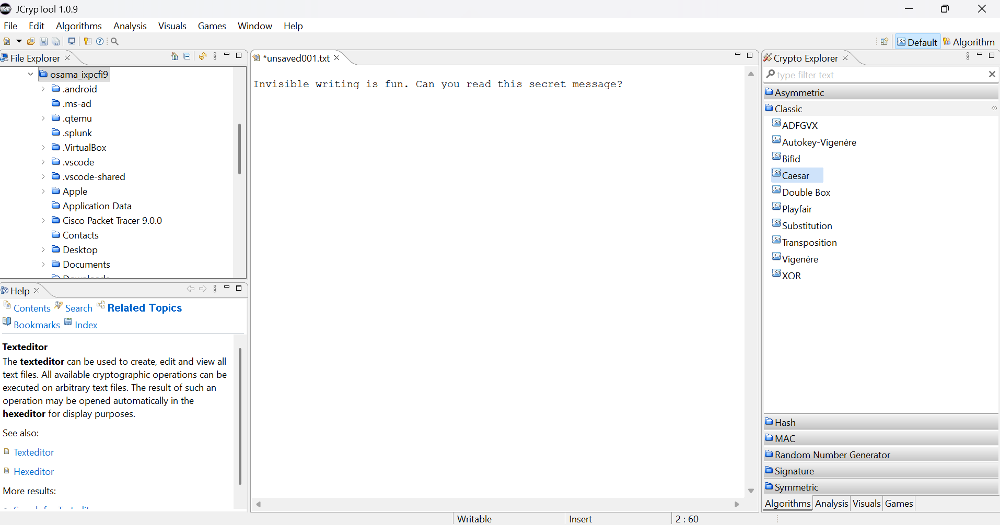

### Step 2: Caesar Cipher Configuration (Shift = 10 / Key = K)
Configured the Caesar algorithm with a shift key of **10** (`K`) using standard Upper and Lower Latin alphabets (A-Z, a-z).

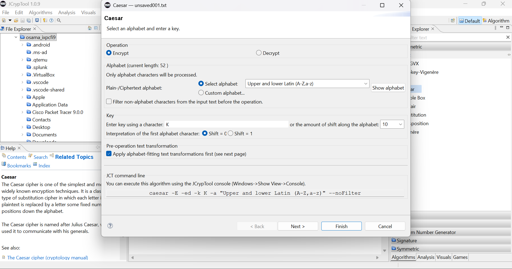

### Step 3: Encrypted Output
The generated ciphertext resulted in scrambled text maintaining case structure:
`SxFsCslvo GBsDsxq sC pEx. Mkx IyE Bokn DrsC ComBoD woCCkqo?`

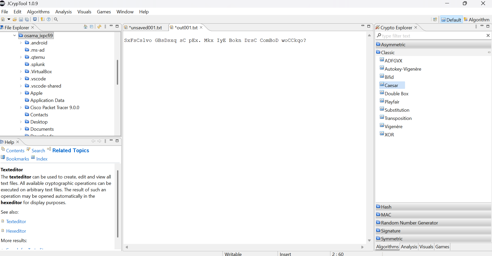

### Step 4: Decryption Process
Reversed the process using the same key (`K` / Shift = 10) in Decryption mode to restore the original plaintext.

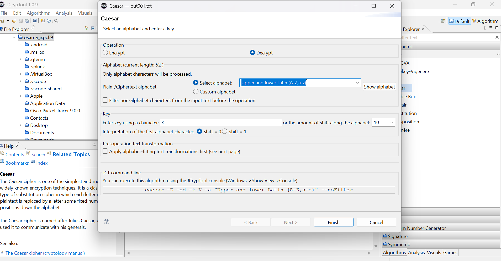

### Step 5: Caesar Cipher (ROT13 Demonstration)
Executed a second test using a **Shift = 13** (ROT13) operation:

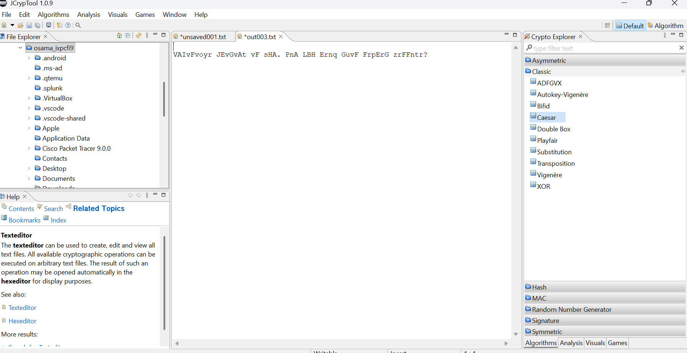

---

## 2. Symmetric Cryptography: AES-128 (ECB Mode)

### Step 1: Encryption Configuration
- **Algorithm:** AES (Advanced Encryption Standard)
- **Key Length:** 128-bit
- **Custom Key (Hex):** `BB 00 00 00 00 00 00 00 00 00 00 00 00 00 00 AA`
- **Mode:** ECB (Electronic Codebook)
- **Padding:** PKCS#5 Padding

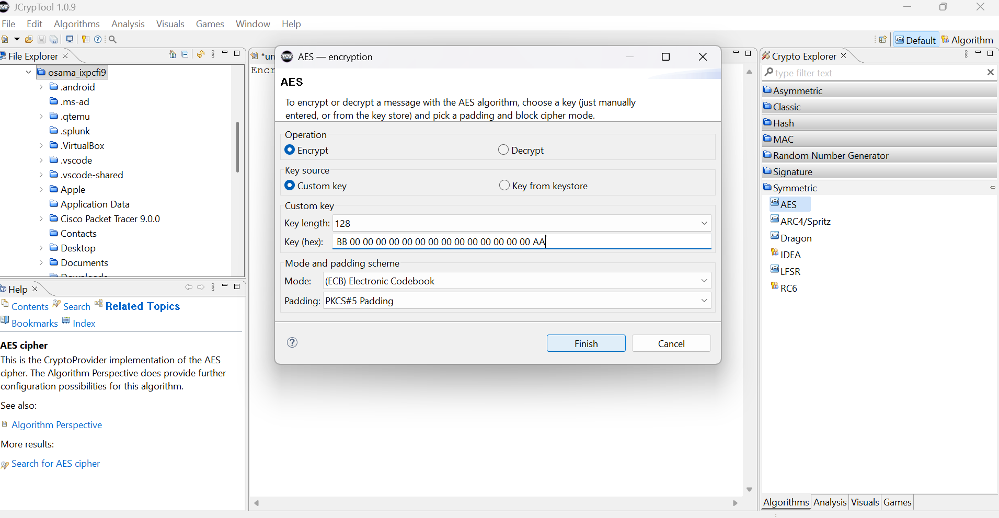

### Step 2: Hexadecimal Ciphertext Output
Because AES produces binary data, the encrypted result is viewed in the Hex Editor (`out004.bin`):

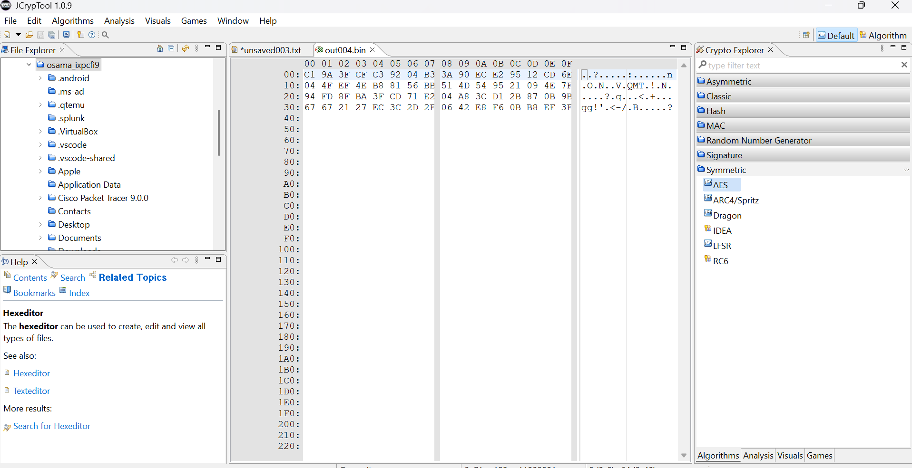

### Step 3: Decryption Setup
Verified reversibility by applying the identical 128-bit key in Decryption mode.

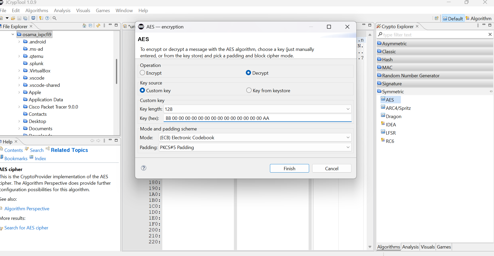

---

## 3. Asymmetric Cryptography: RSA-1024

### Step 1: Key Pair Generation & Encryption Setup
Generated an RSA key pair (`Owner: Osama`, OID: `1.2.840.113549.1.1.1`) inside the JCrypTool Keystore and initialized encryption on the secret plaintext using the **Public Key**.

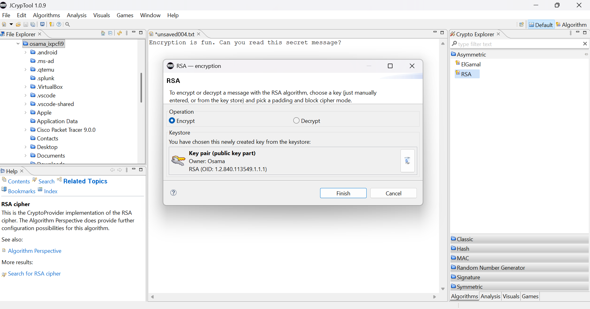

### Step 2: Encrypted Output (Hex View)
The asymmetric encryption output (`out006.bin`) generated a 1024-bit encrypted block:

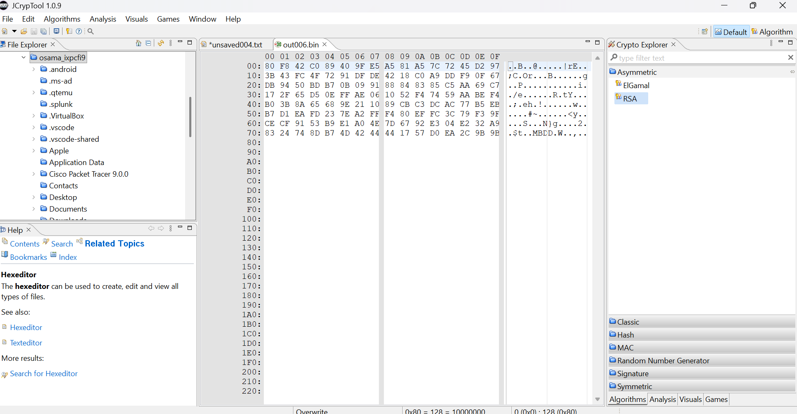

### Step 3: RSA Decryption Process
Reversed the asymmetric operation using the matching **Private Key** (`"Osama" - private key - 1024 bit`) to decrypt the binary payload back to its original plaintext form.

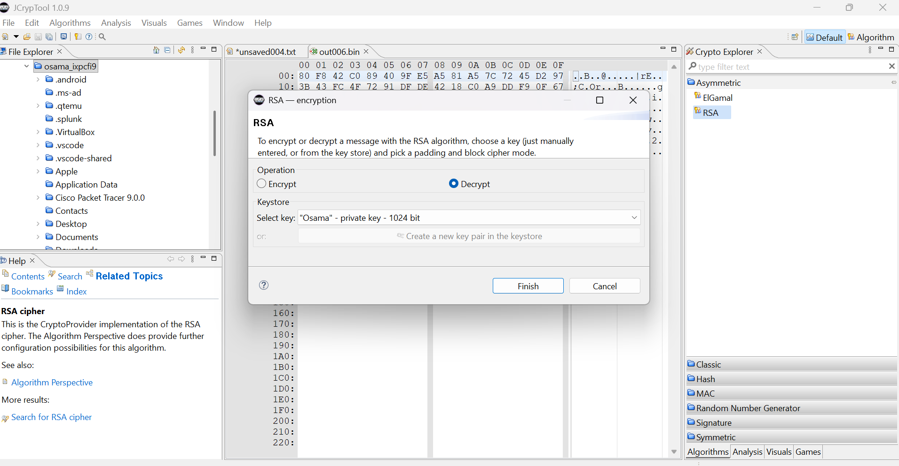

---

## Technical Summary

| Algorithm | Type | Key Size / Parameter | Primary Security Characteristic |
| :--- | :--- | :--- | :--- |
| **Caesar Cipher** | Classical / Substitution | Key = K (Shift = 10 / 13) | Insecure; vulnerable to frequency analysis |
| **AES** | Symmetric Block Cipher | 128-bit | High efficiency, strong confidential data protection |
| **RSA** | Asymmetric Public-Key | 1024-bit | Enables secure key exchange and digital signatures |

---

## Environment & Tools
- **Tool:** JCrypTool 1.0.9
- **OS:** Windows 11
- **Focus Area:** Cryptographic Primitive Behavior & Implementation Verification
